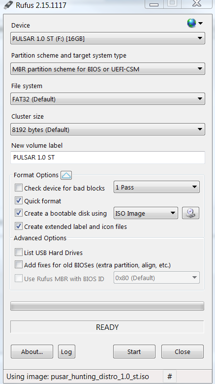
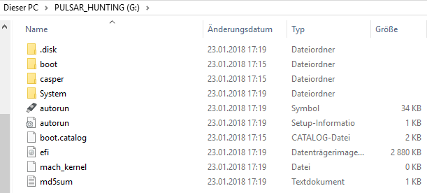
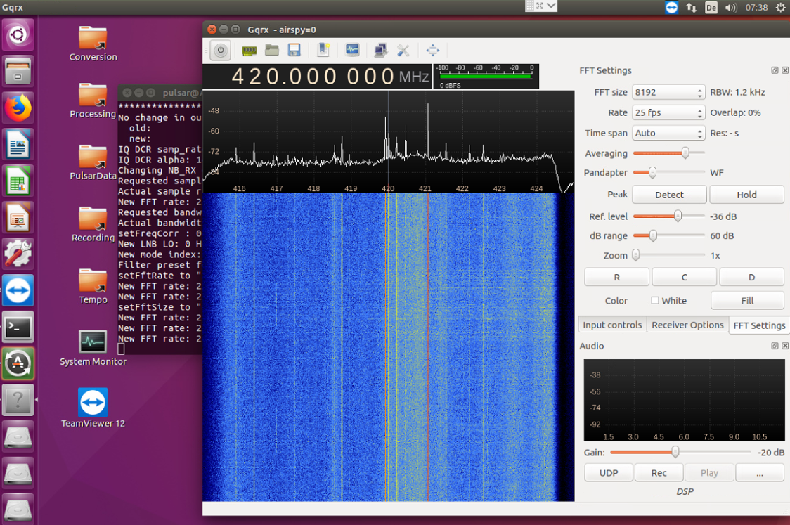
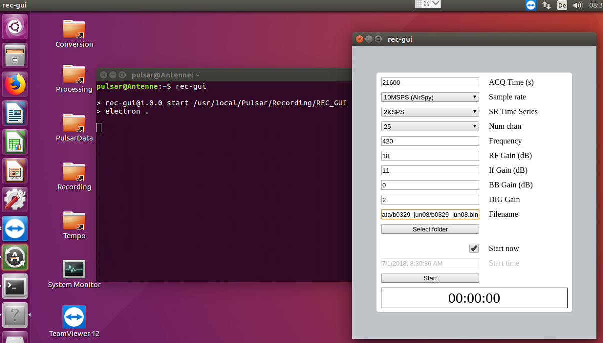
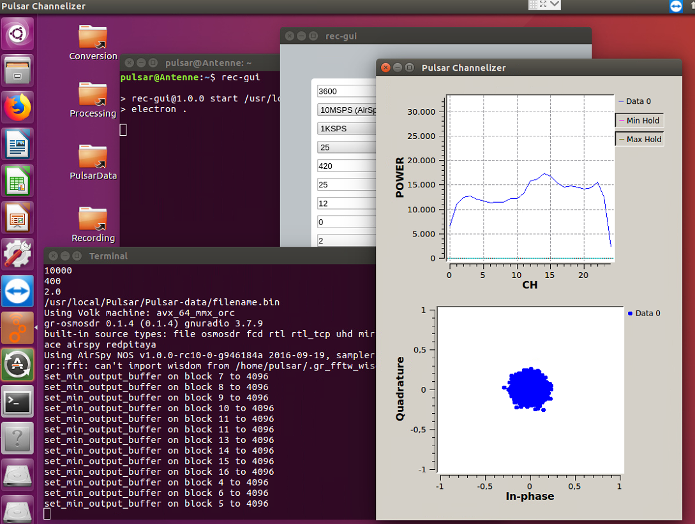
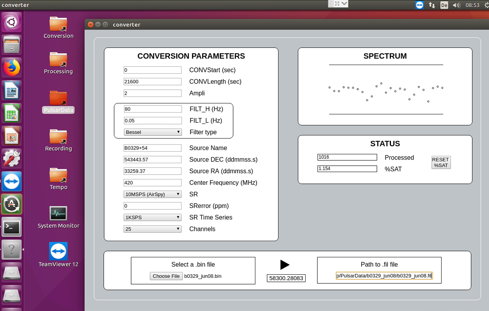
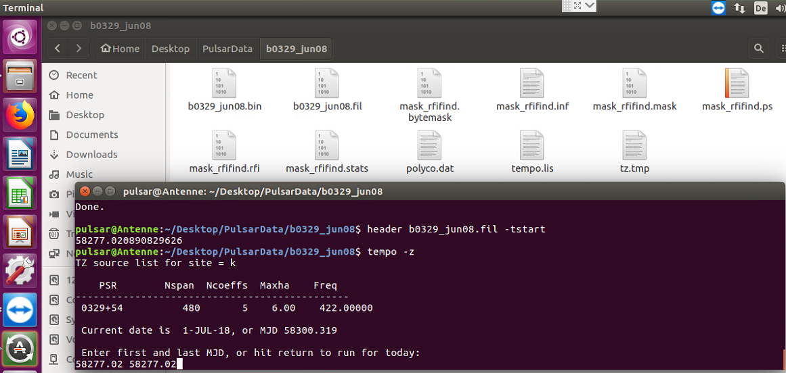
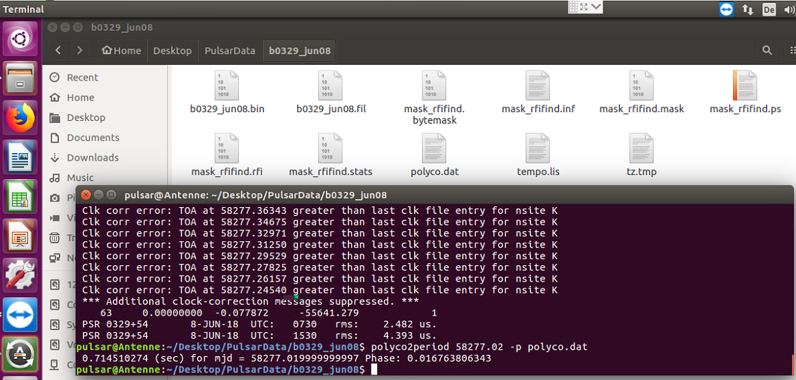
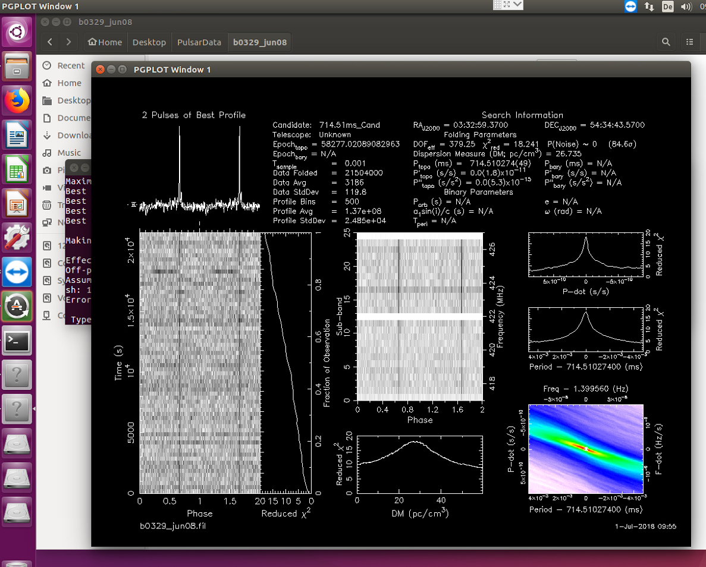

# Linux pulsar software for recording and analysis
#### A step by step guide to receive for the first time the B0329+54 pulsar
_package produced by Giorgio Dell'Immagine and Andrea Dell‘Immagine, IW5BHY_  
_Summary by Hannes Fasching, OE5JFL oe5jfl(at)aon.at_

### Table of contents
* Installation of the distribution
* First boot setup
* Supported SDRs
* Testing out the SDR dongle
* Recording
* Conversion
* Setting up Tempo
* Analysis

## Installation of the distribution
* First of all get the link for downloading the ISO file (2GB) from Andrea or me (OE5JFL)
* make a bootable USB stick using any tool that permit it, `dd` if you are on linux or [rufus](https://rufus.akeo.ie/) if you are on windows; here's an example configuration of rufus:  

* once the process is finished you should see these files on the stick:  

* boot from the stick you have flashed changing the boot priority in the BIOS of your system (for most of modern PCs this is done automatically)
* once the bootloader (`grub`) shows up select the first option (`run linux`)
* if you want to install the OS onto your PC run `ubiquity` tool by double-clicking the `install` icon on the Desktop
* proceed with normal installation of Ubuntu OS (it should be easy but if you're struggling with it you can find tons of guides online like [this one](https://www.zdnet.com/article/ubuntu-15-10-a-walk-through-the-ubiquity-installer/))

> __If you don't want to install the OS on your computer__ you can continue using the system  without running the `ubiquity` installer (this is called  _live mode_); keep in mind however that all the files that are not witten on an physical HD (e.g. your PC's HD) __will be lost when you shutdown the system!__


## First boot setup
After the first boot, open the terminal and the initialization will start; some links will be created on the Desktop.  
Then if you want to optimize the performace of FFT calculations you can run
```
presto-makewisdom
```
Keep in mind that this is a long test that can reqire 20-30 min to complete.

## Supported SDRs
* `RTL-SDR` up to 2.4 MSps
* `Airspy` up to 10 MSps
* `Hack-RF` up to 20 MSps

## Testing out the SDR dongle
To test out the dongle you can run in the terminal
```
gqrx
```
after starting you should see the waterfall.  
This is a basic SDR interface that should be fine if you want to test and experiment with gain, bandwidth and clearness of the band.



To make sure that your PC can handle the realtime acquisition you can do these tests:
1. make sure that in the terminal don't appears `O` characthers. These means 'overflow', so a loss of data that is not tolerable during recording.
2. open the `System Monitor` (icon on Desktop) and look at the CPU usage: this should be `< 80%` while gqrx is running

## Recording
For recording data from the dongle there is a graphical program. To start type in the terminal
```
rec-gui
```
and wait the tool to start.



* __ACQ Time (s)__ - length of acquisition in seconds
* __Sample rate__ - sample rate with the model of SDR dongle
* __SR Time series__ - sample rate of the time series (2KSPS is fine for B0329+54)
* __Num chan__ - number of channels (25 is fine for B0329+54)
* __Frequency__ - center frequency of the acquisition
* __RF gain__ - gain of the RF stage of the dongle (supported by all the dongles)
* __IF gain__ - gain of the intermediate frequency stage of the dongle (supported by Airspy and HackRf only)
* __BB gain__ - gain of the base band stage of the dongle (supported by HackRf only)
* __DIG gain__ - software digital gain (2 is fine for most cases)
* __Filename__ - file name to write on (you can select the folder first then change the name of the file)
> Keep in mind that `PulsarData` folder on Desktop is supposed to contain the acquisitions files, however you can place them wherever you want
* __Start now / Start time__ - you can choose to start now the recording or set a date/time scheudle

> To change default values for the input fields edit `default.conf.xml` in the `Recording/REC_GUI` folder

Once the recording is started you should see the _I/Q cloud_ and the _power per channel_ graphs.



Make sure that the I/Q cloud is neither too small or saturated (it should be approximately like in the picture above). If it's not, tweack the RF/IF/BB gains until you reach a good I/Q amplitude (see above).

## Conversion
When the recording is complete you have to convert the _.bin_ file to a _.fil_ file (format that is used by professional pulsar analysis softwares like presto or sigproc).  
In order to do that just type in the terminal
```
bin2fil
```
and again set the values of the conversion so that they're coherent with the value of the recording.



* __CONVStart / CONVLength__ - the tool will convert from CONVStart CONVLength seconds
* __Ampli__ - scale factor (tweack until you get few % of saturation)
* __FILT_H / FILT_L__ - The filters value are calculated approximately by the formulas
```
FILT_H ~ 600/(pulse width of pulsar) (ms)
FILT_L ~ (pulsar frequency)/20 up to (pulsar frequency)/10
```
* __Source Name__ - name of the pulsar (written in _.fil_ header)
* __Source DEC__ - declination of the pulsar (written in _.fil_ header)
* __Source RA__ - right ascension of the pulsar (written in _.fil_ header)
* __Center Frequency__ - center frequency on the acquisition (written in _.fil_ header)
* __SR__ - sample rate of the acquisition (written in _.fil_ header)
* __SRerror__ - frequency error in ppm of the dongle
* __SR Time Series__ - sample rate of the time series (written in _.fil_ header)
* __Channels__ - number of channels (written in _.fil_ header)

All the values that are written in the _.fil_ header must be consistent with the recording values.
> To change default values for the input fields edit `default.conf.xml` in the `Conversion` folder

## Setting up Tempo
> Tempo is a program for the analysis of pulsar timing data. Pulsar rotation, astrometric, and binary parameters are deduced by fitting models to pulse times of arrival measured at one or more terrestrial observatories. ([more info](http://tempo.sourceforge.net/))

To set up Tempo for your radiotelescope open the `Tempo` folder o Desktop and open `obsys.dat`; here you can find informations about the radiotelescopes that are availables and you can add a line containing data from your location. Here's a printout of the last lines of `obsys.dat` in the distribution:

```
(LATITUDE)    (LONGITUDE)     (ALTITUDE)        (NAME)            (ID)  (INITIALS)
(ddmmss.ss)   (ddmmss.ss)     (m)

355615.0      1060230.0       200.              K5SO              j     SO
440515.0      -102750.0       300               IW5BHY            k     BY
481607.0      -130235.0       300               OE5JFL            l     JF
```
Once you have done that you have to open the `tz.in` file and modify the following values:

```
l 6 480 5 422
  Name     Nspan Ncoeffs (1st line: defaults for nsite,maxha,nspan,ncoeff,freq)
------------------------
0329+54
```


* the first character that is the telescope id defined in `obsys.dat`
* the frequency (in the example is `422` MHz)
* the name of the pulsar you want to calculate for (in the example `0329+54`)

## Analysis
First of all go to the folder containing the _.fil_ file (b0329_test.bin) and open a terminal. Before the folding you should look for RFI in the recording. In order to do that you can run the following command
```
rfifind -o mask -time 1 -timesig 4 -freqsig 15 -chanfrac 1 -intfrac 1 b0329_jun08.fil
```
you can get information about these parameters with `rfifind`. During this process will be created some 'mask' files that indicates if and where are RFIs.

For calculating the pulsar period we need MJD time for the recording. We get this parameter by typing
```
header b0329_jun08.bin –tstart
```
In our case the result is `58227.02`. By the way the `header` command is a very useful tool to display information contained in te header of the _.fil_ file; the syntax is `header filename.fil`.

Now you need to calculate the polynomial curve that represent the change in time of the frequency. To do that type
```
tempo -z
```
and you will be asked for the first and last value of MJD; insert the value calculated previously.



This will create some files, like `ployco.dat` or `tempo.lis`

To calculate the period of the pulsar you can use
```
polyco2period 58277.02 -p polyco.dat
```
this will output the period that you have to copy somewhere for further elaborations.



To fold the data use the command
```
prepfold -nsub 25 -n 500 -topo -dm 26.75 -nosearch -mask mask_rfifind.mask –p 0.714510274  -fine b0329_jun08.fil
```
again you can get information about these parameters with `prepfold`.

If all went good you should finally see the result!



You can now convert the _.ps_ file into an image by opening it in GIMP, import with resolution 300 and export it as a png (or whatever image format you want) file.

For testing we can provide sample _.bin_ files and/or _.fil_ files.

__Good luck!__
